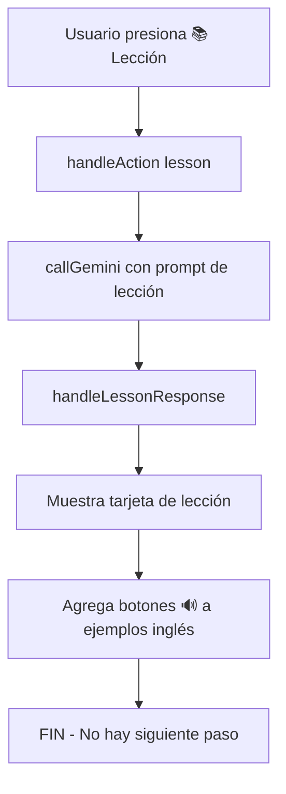
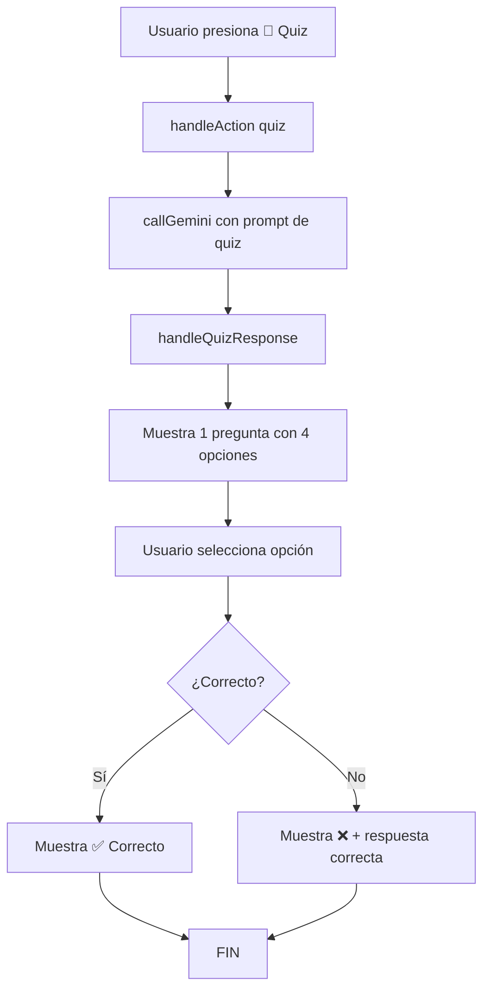
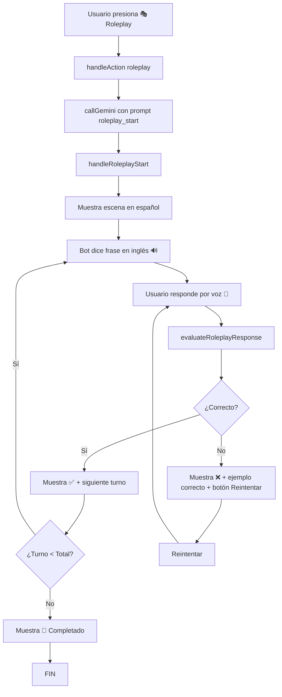
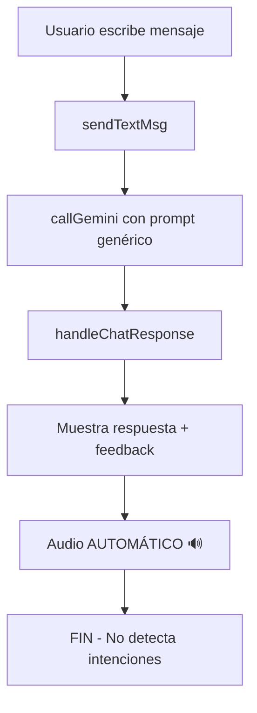

# 📊 ANÁLISIS EXHAUSTIVO: MODO DE APRENDIZAJE - "Profesor IA"

**Fecha:** 21 de noviembre de 2025  
**Versión App:** v4.0  
**Analista:** Sistema de IA

---

## 🎯 RESUMEN EJECUTIVO

El sistema actual de aprendizaje tiene **3 modos principales** (Lección, Quiz, Roleplay) que funcionan mediante **botones fijos** en lugar de una **conversación natural con IA**. El usuario NO puede interactuar libremente con el chatbot para solicitar más contenido, hacer preguntas espontáneas o continuar de forma fluida.

### ⚠️ PROBLEMA PRINCIPAL
**El sistema es RÍGIDO y NO CONVERSACIONAL:**
- Usuario debe presionar botones específicos (📚 Lección, 📝 Quiz, 🎭 Roleplay)
- NO puede escribir "dame más ejercicios" o "explícame mejor"
- NO hay continuidad natural en la conversación
- La IA NO entiende intenciones fuera de los 3 botones predefinidos

---

## 📋 ESTRUCTURA ACTUAL DEL SISTEMA

### 1. **INTERFAZ DE USUARIO (index.html)**

```html
<!-- BOTONES FIJOS -->
<button data-action="lesson">📚 Lección</button>
<button data-action="quiz">📝 Quiz</button>
<button data-action="roleplay">🎭 Roleplay</button>
<button data-action="next">⏭️ Siguiente</button>

<!-- CHAT INPUT -->
<input id="chat-input" placeholder="Escribe...">
<button id="send-btn">Enviar</button>

<!-- MICRÓFONO -->
<button id="mic-btn">🎤</button>
```

**Análisis:**
- ✅ Tiene input de texto y micrófono
- ❌ Los botones son la única forma de activar modos
- ❌ El input de chat NO está conectado a lógica de detección de intenciones

---

### 2. **LÓGICA DE CHAT (js/modules/chat.js)**

#### A) **Función `sendTextMsg()`** (Líneas 168-229)

**Comportamiento Actual:**
```javascript
async function sendTextMsg() {
    const text = input.value.trim();
    
    // Envía CUALQUIER texto al prompt genérico
    const prompt = `
        You are an English Teacher API.
        Task: Evaluate the user's message.
        JSON: { "type": "chat", "reply": "...", "feedback": "..." }
    `;
    
    // Llama a callGemini() con prompt básico
    const data = await callGemini(prompt);
    handleChatResponse(data);
}
```

**Problemas Identificados:**
1. ❌ **NO detecta intenciones**: No sabe si el usuario quiere lección, quiz, o más ejercicios
2. ❌ **Prompt genérico**: Siempre usa el mismo prompt de "evaluar mensaje"
3. ❌ **NO mantiene contexto**: No recuerda si acabas de terminar un quiz
4. ❌ **Tipo fijo**: Siempre devuelve `type: "chat"`, nunca `"quiz"`, `"lesson"`, etc.

**Lo que DEBERÍA hacer:**
```javascript
// Detectar intención del usuario:
if (text.includes("más ejercicios") || text.includes("otro quiz")) {
    action = "quiz";
} else if (text.includes("explica") || text.includes("lección")) {
    action = "lesson";
}
// Entonces llamar a handleAction(action)
```

---

#### B) **Función `handleAction(action)`** (Líneas 275-395)

**Comportamiento Actual:**
```javascript
async function handleAction(action) {
    if (action === 'lesson') {
        prompt = `Generate a lesson...`;
    } else if (action === 'quiz') {
        prompt = `Generate a quiz...`;
    } else if (action === 'roleplay') {
        prompt = `Start roleplay...`;
    }
    
    const data = await callGemini(prompt);
    
    // Maneja SOLO respuestas predefinidas
    if (data.type === 'lesson') handleLessonResponse(data);
    else if (data.type === 'quiz') handleQuizResponse(data);
    else if (data.type === 'roleplay_start') handleRoleplayStart(data);
}
```

**Problemas Identificados:**
1. ❌ **Solo se activa con botones**: No hay forma de llamarlo desde `sendTextMsg()`
2. ❌ **Funciones separadas**: Chat y acciones son mundos distintos
3. ❌ **NO hay puente**: El usuario no puede decir "dame un quiz" y activar `handleAction('quiz')`

**Lo que DEBERÍA hacer:**
- Ser llamada TAMBIÉN desde `sendTextMsg()` cuando se detecta una intención
- Tener un sistema de intenciones unificado

---

#### C) **Función `handleChatResponse(data)`** (Líneas 231-273)

**Comportamiento Actual:**
```javascript
function handleChatResponse(data) {
    let html = '';
    
    if (data.correction) {
        html += `<div>Corrección: ${data.correction}</div>`;
    }
    
    if (data.feedback) {
        html += `<div>${data.feedback}</div>`;
    }
    
    if (data.reply) {
        html += `<div>${data.reply} 🔊</div>`;
        speakText(data.reply, 'en-US'); // ❌ AUDIO AUTOMÁTICO
    }
}
```

**Problemas Identificados:**
1. ❌ **Audio automático**: Línea 269 reproduce automáticamente `speakText(data.reply, 'en-US')`
2. ❌ **NO respeta preferencia**: Usuario pide que SOLO se lea al hacer clic en 🔊
3. ❌ **Formato fijo**: Solo maneja corrección + feedback + reply
4. ❌ **NO traduce**: Todo está en inglés sin traducción visible en español

---

### 3. **MODO LECCIÓN (handleLessonResponse)**

**Comportamiento Actual:**
```javascript
function handleLessonResponse(data) {
    const content = marked.parse(data.content_markdown);
    
    // Crea tarjeta de lección
    lessonCard.innerHTML = `
        <h3>${data.title}</h3>
        <div class="lesson-content">${content}</div>
    `;
    
    // Agrega botones de audio a ejemplos en inglés
    setTimeout(() => {
        elements.forEach(element => {
            if (isEnglishText(text)) {
                const audioBtn = createAudioButton(text, 'en-US');
                element.appendChild(audioBtn);
            }
        });
    }, 100);
}
```

**Análisis:**
✅ **LO QUE FUNCIONA:**
- Muestra lección en tarjeta full-width
- Agrega botones 🔊 SOLO a texto en inglés (no automático)
- Usa Markdown para formato

❌ **LO QUE FALTA:**
- **NO hay forma de pedir "más ejemplos"** después de ver la lección
- **NO se puede preguntar "¿qué significa X?"** sobre la lección
- **NO hay continuidad**: Termina la lección y nada más
- **NO traduce ejemplos**: Los ejemplos en inglés NO tienen traducción al español
- **Audio NO es opcional**: Se reproduce automáticamente en chat (línea 269)

---

### 4. **MODO QUIZ (handleQuizResponse)**

**Comportamiento Actual:**
```javascript
function handleQuizResponse(data) {
    const html = `
        <p>${data.question}</p>  <!-- Pregunta en español -->
        <div class="quiz-options">
            ${data.options.map((opt, idx) => `
                <button class="quiz-option" data-index="${idx}">
                    ${opt}  <!-- Opción en inglés -->
                </button>
            `).join('')}
        </div>
        <div id="quiz-feedback" class="hidden"></div>
    `;
    
    // Event listeners para opciones
    options.forEach(btn => {
        btn.addEventListener('click', (e) => {
            if (selectedIdx === data.answer_index) {
                feedback.textContent = '¡Correcto!';
                feedback.style.background = '#D1FAE5';
            } else {
                feedback.textContent = `Incorrecto. Respuesta: ${data.options[data.answer_index]}`;
                feedback.style.background = '#FEE2E2';
            }
        });
    });
}
```

**Análisis:**
✅ **LO QUE FUNCIONA:**
- Pregunta en español, opciones en inglés (correcto)
- Feedback inmediato al seleccionar
- Muestra respuesta correcta si falla

❌ **LO QUE FALTA:**
- **NO puedes pedir "otro quiz" o "más preguntas"** después de responder
- **NO hay contador**: "Pregunta 3/10"
- **NO guarda estadísticas**: Cuántas correctas/incorrectas
- **NO explica por qué**: Solo dice "incorrecto" sin explicación pedagógica
- **Termina abruptamente**: Respondes y ya, no hay continuación
- **NO tiene traducción en respuestas**: La respuesta correcta NO muestra traducción

---

### 5. **MODO ROLEPLAY (handleRoleplayStart, evaluateRoleplayResponse)**

**Comportamiento Actual:**

**Inicio (handleRoleplayStart):**
```javascript
function handleRoleplayStart(data) {
    roleplayState = {
        active: true,
        turnNumber: 1,
        totalTurns: 5,
        sceneDescription: data.scene_description,
        lastBotSpeech: data.bot_speech
    };
    
    // Muestra escena en español
    sceneCard.innerHTML = `
        <h3>🎭 Escena de Roleplay</h3>
        <p>${data.scene_description}</p>  <!-- Español -->
    `;
    
    // Muestra diálogo del bot en inglés con botón 🔊
    botCard.innerHTML = `
        <p>${data.bot_speech}</p> 🔊  <!-- Inglés -->
    `;
    
    // Activa micrófono
    micBtn.style.background = 'green';
}
```

**Evaluación (evaluateRoleplayResponse):**
```javascript
async function evaluateRoleplayResponse(userSpeech) {
    const prompt = `
        Evaluate: "${userSpeech}"
        JSON: {
            "type": "roleplay_feedback",
            "is_correct": true/false,
            "feedback_es": "Feedback en español",
            "correct_example": "Correct English",
            "suggestion_es": "Sugerencia"
        }
    `;
    
    const data = await callGemini(prompt);
    handleRoleplayFeedback(data);
    
    if (data.is_correct && turnNumber < totalTurns) {
        // Continuar automáticamente al siguiente turno
        handleRoleplayContinue(nextData);
    }
}
```

**Análisis:**
✅ **LO QUE FUNCIONA:**
- Descripción de escena en español
- Bot habla en inglés con botón 🔊 (NO automático)
- Evaluación paso a paso
- Feedback en español
- Sistema de turnos (N/Total)
- Ejemplo correcto con traducción

❌ **LO QUE FALTA:**
- **NO puedes pausar y preguntar**: "¿Cómo se dice X en esta situación?"
- **NO puedes saltar turnos**: Debes completar los 5 turnos fijos
- **NO puedes cambiar de escenario**: Solo hay 1 escena por topic
- **Progresión forzada**: Si respondes bien, avanza automáticamente
- **NO hay variaciones**: Siempre 5 turnos, sin opciones

---

## 🚨 PROBLEMAS CRÍTICOS IDENTIFICADOS

### ❌ **PROBLEMA #1: AUDIO AUTOMÁTICO**
**Ubicación:** `chat.js` línea 269
```javascript
if (data.reply) {
    speakText(data.reply, 'en-US'); // ❌ Se reproduce AUTOMÁTICAMENTE
}
```

**Impacto:**
- Cada respuesta del bot se lee en voz alta sin permiso del usuario
- No respeta la preferencia de "solo al hacer clic en 🔊"
- Consume batería y puede ser molesto en espacios públicos

**Solución Requerida:**
- ELIMINAR `speakText()` automático
- Solo reproducir cuando usuario hace clic en botón 🔊

---

### ❌ **PROBLEMA #2: FALTA DE DETECCIÓN DE INTENCIONES**
**Ubicación:** `chat.js` función `sendTextMsg()`

**Escenarios que NO funcionan:**
```
Usuario escribe: "dame más ejercicios"
→ Bot responde: "Sure, I can help you practice" (genérico)
→ ❌ NO genera un quiz

Usuario escribe: "explícame los verbos modales"
→ Bot responde: "Modal verbs are..." (texto simple)
→ ❌ NO muestra lección formateada

Usuario escribe: "continúa" después de un quiz
→ Bot responde: "Continue with what?" (no entiende contexto)
→ ❌ NO genera otro quiz automáticamente
```

**Solución Requerida:**
Sistema de NLU (Natural Language Understanding) que detecte:
- Intención de lección: "explica", "qué es", "enséñame"
- Intención de quiz: "ejercicio", "prueba", "pregunta", "más preguntas"
- Intención de roleplay: "practica", "conversación", "roleplay"
- Continuación: "continúa", "siguiente", "otro", "más"

---

### ❌ **PROBLEMA #3: FALTA DE TRADUCCIÓN AL ESPAÑOL**

**Elementos sin traducción:**

1. **Ejemplos en lecciones:**
```
Actual: "I am a teacher" 🔊
Debería: "I am a teacher (Soy un profesor)" 🔊
```

2. **Opciones de quiz (feedback):**
```
Actual: "Incorrecto. La respuesta era: Good morning"
Debería: "Incorrecto. La respuesta era: Good morning (Buenos días)"
```

3. **Respuestas del chatbot:**
```
Actual: "You can use modal verbs to express..."
Debería: Bot en español + ejemplo en inglés con traducción
```

**Solución Requerida:**
- Todos los textos en inglés deben tener `(traducción española)`
- Solo el inglés tiene botón 🔊
- El español es solo visual, no se lee

---

### ❌ **PROBLEMA #4: NO HAY CONTINUIDAD CONVERSACIONAL**

**Flujo Actual (RÍGIDO):**
```
1. Usuario presiona "📚 Lección"
2. Se muestra lección
3. [FIN] - No hay más interacción

4. Usuario presiona "📝 Quiz"
5. Se muestra 1 pregunta
6. Usuario responde
7. [FIN] - No puede pedir más preguntas
```

**Flujo Deseado (FLUIDO):**
```
1. Usuario: "Dame una lección sobre verbos"
2. Bot: [Muestra lección]
3. Usuario: "Dame un ejemplo más"
4. Bot: [Muestra ejemplo adicional]
5. Usuario: "Ahora hazme preguntas"
6. Bot: [Genera quiz]
7. Usuario: "Otra pregunta"
8. Bot: [Genera otra pregunta]
9. Usuario: "Suficiente, gracias"
10. Bot: "¡Bien hecho! Resumen de tu progreso..."
```

**Solución Requerida:**
- Sistema de estado conversacional
- Memoria de lo que acaba de pasar
- Capacidad de extender cualquier modo

---

## 🎯 ANÁLISIS DE FLUJOS ACTUALES

### FLUJO 1: LECCIÓN



**Problemas:**
- ❌ No hay forma de extender la lección
- ❌ No puedes preguntar sobre algo específico
- ❌ No hay ejercicios de seguimiento

---

### FLUJO 2: QUIZ



**Problemas:**
- ❌ Solo 1 pregunta por clic
- ❌ No hay contador ni progreso
- ❌ No puedes pedir más automáticamente

---

### FLUJO 3: ROLEPLAY



**Problemas:**
- ❌ Flujo rígido de 5 turnos fijos
- ❌ No puedes hacer preguntas durante el roleplay
- ❌ Progresión automática sin opción de pausa

---

### FLUJO 4: CHAT LIBRE (ACTUAL - NO FUNCIONAL)



**Problemas:**
- ❌ No detecta intenciones ("dame quiz", "explica")
- ❌ Audio automático
- ❌ No cambia de modo según contexto

---

## ✅ SOLUCIONES PROPUESTAS

### SOLUCIÓN 1: SISTEMA DE INTENCIONES (NLU)

**Crear función `detectIntent(userMessage)`:**

```javascript
function detectIntent(userMessage) {
    const msg = userMessage.toLowerCase();
    
    // Intenciones de Lección
    if (/explica|enseña|lección|qué es|cómo funciona|teoría/i.test(msg)) {
        return { intent: 'lesson', confidence: 0.9 };
    }
    
    // Intenciones de Quiz
    if (/quiz|ejercicio|pregunta|prueba|evalúa|test|más preguntas/i.test(msg)) {
        return { intent: 'quiz', confidence: 0.9 };
    }
    
    // Intenciones de Roleplay
    if (/roleplay|practica|conversación|simula|actúa/i.test(msg)) {
        return { intent: 'roleplay', confidence: 0.9 };
    }
    
    // Continuación
    if (/continúa|siguiente|otro|más|otra vez/i.test(msg)) {
        return { intent: 'continue', confidence: 0.8 };
    }
    
    // Ejemplo adicional
    if (/ejemplo|muestra|dame más/i.test(msg)) {
        return { intent: 'more_examples', confidence: 0.8 };
    }
    
    // Chat genérico
    return { intent: 'chat', confidence: 0.5 };
}
```

**Integrar en `sendTextMsg()`:**

```javascript
async function sendTextMsg() {
    const text = input.value.trim();
    const detected = detectIntent(text);
    
    if (detected.intent === 'lesson') {
        await handleAction('lesson');
    } else if (detected.intent === 'quiz') {
        await handleAction('quiz');
    } else if (detected.intent === 'continue') {
        await handleContinuation();
    } else {
        // Chat conversacional mejorado
        await handleConversationalChat(text);
    }
}
```

---

### SOLUCIÓN 2: ELIMINAR AUDIO AUTOMÁTICO

**Modificar `handleChatResponse()`:**

```javascript
function handleChatResponse(data) {
    let html = '';
    
    if (data.reply) {
        html += `<div>
            ${data.reply}
            <span id="reply-audio-btn"></span>
        </div>`;
    }
    
    const msgId = addMessageToUI(html, 'bot');
    
    // ❌ ELIMINAR ESTA LÍNEA:
    // speakText(data.reply, 'en-US');
    
    // ✅ SOLO agregar botón 🔊
    const audioContainer = document.querySelector(`#${msgId} #reply-audio-btn`);
    if (audioContainer && data.reply) {
        const audioBtn = createAudioButton(data.reply, 'en-US');
        audioContainer.appendChild(audioBtn);
    }
}
```

---

### SOLUCIÓN 3: AGREGAR TRADUCCIONES AUTOMÁTICAS

**Modificar prompts para solicitar traducciones:**

```javascript
// Ejemplo: Prompt de Quiz
prompt = `
    Generate quiz question.
    JSON:
    {
        "type": "quiz",
        "question": "Question in Spanish",
        "options": [
            {"en": "Good morning", "es": "Buenos días"},
            {"en": "Good night", "es": "Buenas noches"}
        ],
        "answer_index": 0
    }
`;
```

**Renderizar con traducciones:**

```javascript
function handleQuizResponse(data) {
    html = data.options.map((opt, idx) => `
        <button data-index="${idx}">
            ${opt.en} <span style="color: #888">(${opt.es})</span>
        </button>
    `).join('');
}
```

---

### SOLUCIÓN 4: SISTEMA DE CONTINUACIÓN

**Agregar estado conversacional:**

```javascript
let conversationContext = {
    lastAction: null,        // 'lesson', 'quiz', 'roleplay'
    lastTopic: null,         // "Present Simple"
    quizCount: 0,            // Contador de preguntas
    canContinue: false       // ¿Se puede pedir "más"?
};

function handleContinuation() {
    if (conversationContext.lastAction === 'quiz') {
        // Generar otro quiz del mismo tema
        handleAction('quiz');
        conversationContext.quizCount++;
    } else if (conversationContext.lastAction === 'lesson') {
        // Generar ejemplos adicionales
        generateMoreExamples(conversationContext.lastTopic);
    }
}
```

---

## 📊 TABLA COMPARATIVA: ANTES vs DESPUÉS

| Característica | ❌ ANTES (Actual) | ✅ DESPUÉS (Propuesto) |
|---|---|---|
| **Activación de modos** | Solo por botones fijos | Texto libre + botones |
| **Intención "dame quiz"** | No funciona | Genera quiz automáticamente |
| **Continuación de quiz** | Imposible | "Otra pregunta" funciona |
| **Audio** | Automático | Solo al hacer clic 🔊 |
| **Traducciones** | Solo algunas | Todas las frases inglesas |
| **Contexto conversacional** | No existe | Recuerda última acción |
| **Ejemplos adicionales** | Imposible pedirlos | "Dame más ejemplos" funciona |
| **Roleplay pausable** | No, flujo forzado | Puedes preguntar en medio |
| **Contador de progreso** | No hay | "Pregunta 3/10" visible |

---

## 🚀 ARQUITECTURA PROPUESTA: CHAT CONVERSACIONAL INTELIGENTE

```javascript
// FLUJO MEJORADO
async function sendTextMsg() {
    const text = input.value.trim();
    
    // 1. Detectar intención
    const intent = detectIntent(text);
    
    // 2. Verificar contexto
    const context = getConversationContext();
    
    // 3. Decidir acción
    if (intent === 'lesson') {
        await handleAction('lesson');
        updateContext({ lastAction: 'lesson' });
    } else if (intent === 'quiz') {
        await handleAction('quiz');
        updateContext({ lastAction: 'quiz', quizCount: 1 });
    } else if (intent === 'continue') {
        await handleContinuation(context);
    } else if (intent === 'more_examples') {
        await generateExamples(context.lastTopic);
    } else {
        // Chat conversacional con memoria
        await handleSmartChat(text, context);
    }
}
```

---

## 🎯 RECOMENDACIONES FINALES

### PRIORIDAD ALTA 🔴

1. **ELIMINAR audio automático** (1 línea de código)
2. **Implementar `detectIntent()`** para entender texto libre
3. **Agregar traducciones** a TODOS los textos en inglés

### PRIORIDAD MEDIA 🟡

4. **Sistema de continuación** ("otra pregunta", "más ejemplos")
5. **Contador de progreso** en quizzes
6. **Contexto conversacional** para recordar última acción

### PRIORIDAD BAJA 🟢

7. **Roleplay pausable** con preguntas intermedias
8. **Estadísticas de aprendizaje** (correctas/incorrectas)
9. **Resumen al final** de cada sesión

---

## 📝 PROMPT PARA OTRA IA (Claude/ChatGPT)

**Copia y pega esto en otra IA para obtener más sugerencias:**

---

> **CONTEXTO:**
> Tengo una aplicación web PWA de enseñanza de inglés con IA (Gemini). Actualmente tiene 3 modos: Lección, Quiz y Roleplay, activados por botones fijos. El usuario NO puede interactuar naturalmente escribiendo "dame más ejercicios" o "explícame mejor".
>
> **PROBLEMAS IDENTIFICADOS:**
> 1. No detecta intenciones en texto libre
> 2. Audio se reproduce automáticamente (debe ser solo al hacer clic)
> 3. Falta traducción al español en muchos textos en inglés
> 4. No hay continuidad conversacional (no puedes pedir "otra pregunta")
> 5. Flujos rígidos sin flexibilidad
>
> **ARQUITECTURA ACTUAL:**
> - `sendTextMsg()`: Envía texto a Gemini con prompt genérico
> - `handleAction(action)`: Maneja 'lesson', 'quiz', 'roleplay' desde botones
> - `handleChatResponse()`: Muestra respuesta y reproduce audio automáticamente
> - NO hay sistema de detección de intenciones
> - NO hay memoria conversacional
>
> **LO QUE NECESITO:**
> 1. Sistema de NLU (Natural Language Understanding) para detectar intenciones como:
>    - "dame un quiz" → Activar modo quiz
>    - "explícame los verbos" → Activar modo lección
>    - "otra pregunta" → Generar otro quiz si estoy en contexto de quiz
>    - "más ejemplos" → Extender lección actual
>
> 2. Eliminar audio automático, solo reproducir al hacer clic en botón 🔊
>
> 3. Agregar traducciones (Inglés con traducción española entre paréntesis) en:
>    - Ejemplos de lecciones
>    - Opciones de quiz
>    - Respuestas del chatbot
>
> 4. Sistema de continuación inteligente que recuerde:
>    - Última acción realizada
>    - Tema actual
>    - Contador de preguntas/ejercicios
>
> **PREGUNTA:**
> ¿Cómo diseñarías un sistema conversacional inteligente que permita interacción fluida y natural, sin depender de botones fijos, manteniendo la estructura JSON actual de Gemini? Dame:
> 1. Arquitectura de detección de intenciones
> 2. Sistema de gestión de contexto conversacional
> 3. Prompts mejorados para Gemini
> 4. Flujo de decisión para manejar diferentes intenciones
> 5. Mejoras UX para que sea completamente dinámico

---

## 🎓 CONCLUSIÓN

El sistema actual es **FUNCIONAL pero RÍGIDO**. Para convertirlo en un verdadero **profesor conversacional**, necesita:

1. ✅ Detección de intenciones en lenguaje natural
2. ✅ Memoria conversacional (contexto)
3. ✅ Audio NO automático (solo al hacer clic)
4. ✅ Traducciones completas al español
5. ✅ Continuidad fluida entre modos

**Con estos cambios, el usuario podrá:**
- Escribir "dame más ejercicios" y obtener un quiz
- Decir "no entendí, explícame mejor" y recibir ejemplos adicionales
- Pedir "otra pregunta" y continuar practicando
- Tener una conversación natural como con un profesor real

---

**Fin del Análisis** 🎯
